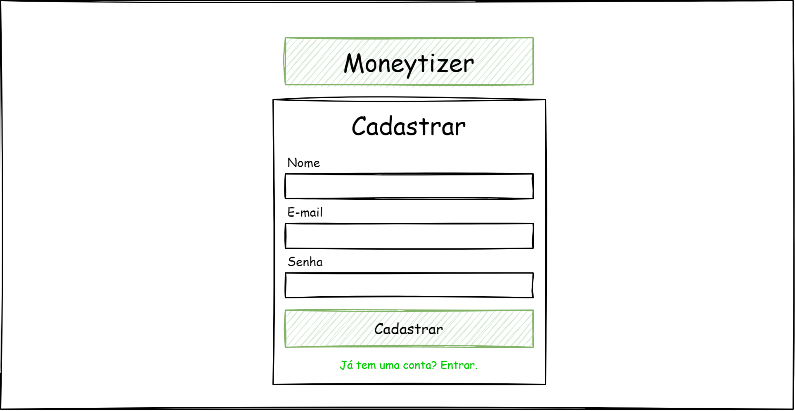
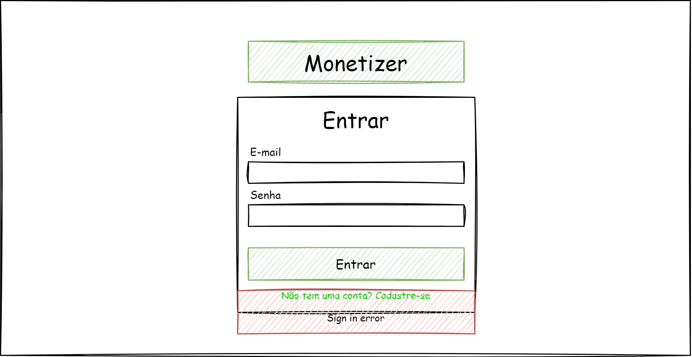

# Moneytizer

Projeto criado para demonstrar como fazer o desenvolvimento de uma solução que envolve frontend e backend. 

## Dependências

- [VSCode](https://code.visualstudio.com/)
- [NodeJS](https://nodejs.org/en/)

## Como iniciar

1. Clone o repositório e acesse o mesmo
2. Acesse as pastas `api` e `web` e faça as instalações com o comando `npm init`

Para rodar os 2 projetos ao mesmo tempo foi criado um `package.json` contendo o script inicial `npm start`. Esse script roda tanto a API quanto o WEB utilizando a lib [concurrently](https://www.npmjs.com/package/concurrently)

Cada projeto já veio com uma configuração minima necessária para o funcionamento. Espera-se seja utilizado as bibliotecas:

- <u>frontend</u>:
  - **ReactJS**, tendo liberdade sobre a escolha de qual biblioteca utilizar para controle de estado, construção dos estilos e comunicação com o backend
- <u>backend</u>:
  - **ExpressJS** para construção da API
  - **Sequelize** para comunicação com o banco de dados
  - **MySQL** como persistência de banco de dados

Em ambos os projetos espera-se que seja utilizado o Javascript ao invés do Typescript

## Contexto

Você deverá construir uma aplicação para gerir movimentações financeiras de pessoas. Essa aplicação deve permitir que uma pessoa veja SOMENTE as suas movimentações financeiras. Além disso essa pessoa pode ver, adicionar, alterar e remover suas movimentações. Para mais contexto temos as imagens abaixo:

> Tela para cadastro

> Tela para acesso

> Exemplo de mensagem de erro (toast)

> Tela principal com todas as movimentações

> Tela de adicionar uma movimentação

> Tela de alterar uma movimentação

